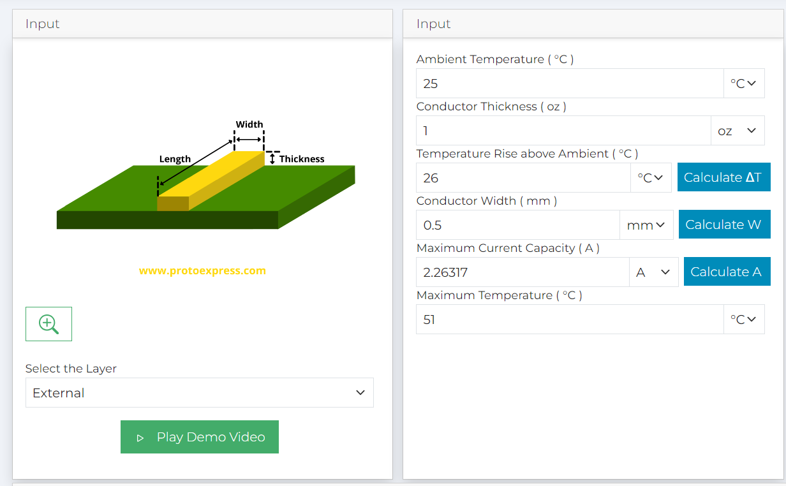
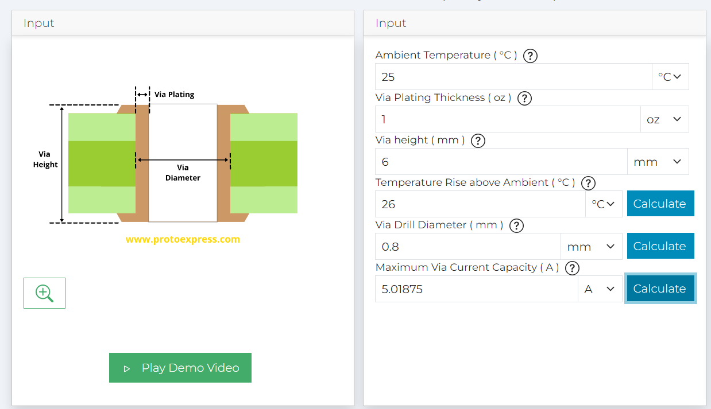

## Equation for the spring constant
$k=\frac{Gd^4}{8D^3N}$ \
Where:
- d: Wire Diameter
- D: Mean Diameter
- N: Active Coils
- G: Shear Modulus of Material
- k: Spring Constant

## PCB Parameters
PCB Trace width is selected as 0.5mm which can handle 2.3A at ambient conditions. \

PCB via diameter is set to 1mm with 8mm hole size which can handle maximum of 5A  at ambieant conditions.\

The results are generated by SIERRA circuit calculators
Sierra trace width calculator
Sierra via diameter calculator
